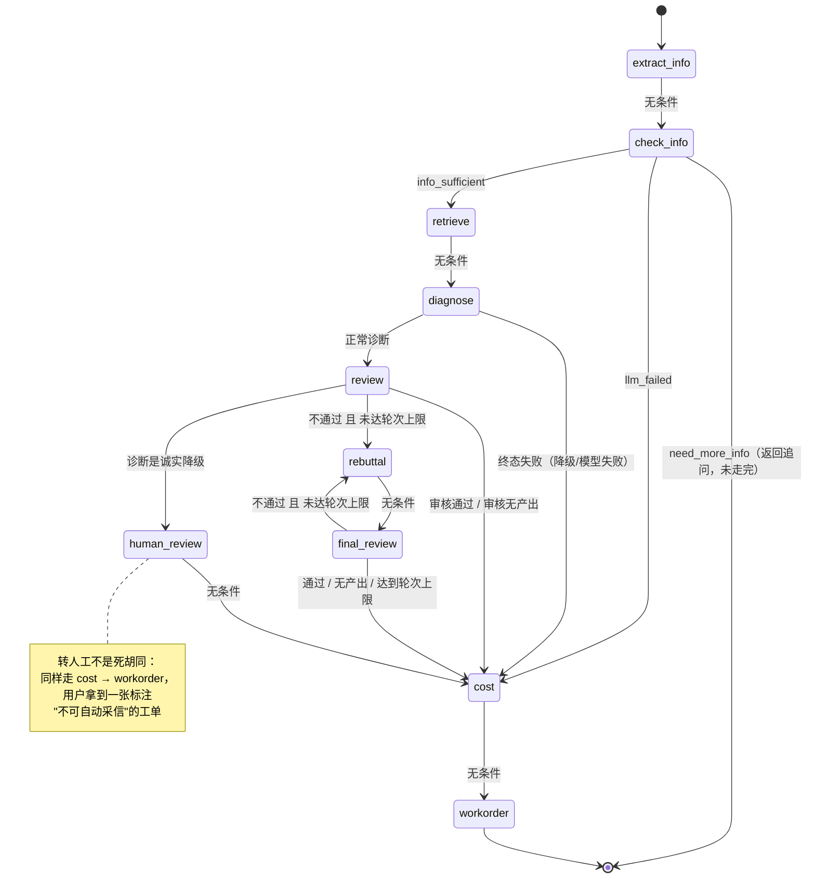

# FlawScope 状态机流转图

> 本图由 `orchestrator.py` 的 `graph.add_node/add_edge/add_conditional_edges`
> **逐行核对生成**，不是凭印象画的。改动状态机后请同步本文件
> （回归测试 `tests/test_state_diagram.py` 会检查节点与路由函数的对应关系）。

## 一、总览



## 二、九个节点

| # | 节点名 | 说明 | 调 LLM |
|---|---|---|---|
| ① | `extract_info` | 信息抽取：口语化描述 → 结构化字段 | 是 |
| ② | `check_info` | 信息核验：判断信息是否充分 | 否（纯规则） |
| ③ | `retrieve` | 知识检索：混合检索（向量 + BM25 + RRF） | 嵌入模型 |
| ④ | `diagnose` | 诊断分析：诊断师基于证据判断根因 | 是 |
| ⑤ | `review` | 方案审核：审核师把关诊断结论 | 是 |
| ⑥ | `rebuttal` | 辩论反驳：诊断师回应驳回并修正 | 是 |
| ⑦ | `final_review` | 最终复审：审核师终审 | 是 |
| ⑧ | `cost` | 成本精算：提取备件工时并计算费用 | 是（但**算术走纯函数**） |
| ⑨ | `workorder` | 工单生成：汇总输出维修工单 | 是 |
| — | `human_review` | 转人工：不调模型，只标记状态 | 否 |

## 三、五条退出路径（本项目的核心设计）

这张图最值得看的地方不是主干，而是**几条提前退出的岔路**——
它们各自对应一类"不能硬答"的情况：

| 退出点 | 触发条件 | 最终状态 | 用户拿到什么 |
|---|---|---|---|
| `check_info → END` | 模型正常但抽不出关键信息 | `need_more_info` | 一个追问，**不是**一张瞎猜的工单 |
| `check_info → cost` | 抽取阶段**调用失败** | `llm_failed` | 带风险标记的降级工单 |
| `diagnose → cost` | 检索无依据 / 设备不匹配 | `insufficient_knowledge` | 带"知识库无依据"的降级工单 |
| `review → human_review` | 诊断结论本身是降级 | `pending_human_review` | 标注"不可自动采信"的工单 |
| `final_review → cost` | 辩论到上限仍不通过 | `done` + 高风险 | 带"高风险待复核"的工单 |

> **共同点：没有任何一条路径是"什么都不给"的死胡同。**
> 这是 2026-09 重构时定下的硬约束——每个降级分支都必须走到 `workorder`，
> 并在「风险等级」里写明原因。

## 四、辩论环

`review → rebuttal → final_review → rebuttal → ... → cost` 构成一个环，
由 `state["debate_round"] < state["max_debate_rounds"]` 控制跳出。

实测（`tools/trace_diagnosis.py debate`，上限压到 2 轮），节点访问序列是：

```
①  →  ②  →  ③  →  ④  →  ⑤  →  ⑥  →  ⑦  →  ⑥  →  ⑦  →  ⑧  →  ⑨
                              └──── 环 ────┘
```

注意 ⑥⑦ **出现了两次**——这就是状态机里的那个环。
`max_debate_rounds` 默认 3，演示时压到 2 是为了输出更短。

## 五、自己跑一遍

```bash
# 看全部 6 个场景的逐节点流转（不联网、不花钱）
venv/Scripts/python.exe tools/trace_diagnosis.py

# 只看辩论环
venv/Scripts/python.exe tools/trace_diagnosis.py debate

# 导出机器可读 trace（面试演示、回归对比用）
venv/Scripts/python.exe tools/trace_diagnosis.py --json
```

`--json` 产出的 `trace_report.json` 包含每个场景的节点访问顺序、
每节点耗时、状态变迁与变更字段，可用于：
- 面试时现场演示"这个环我真的跑通了"
- 改状态机后对比**访问序列有没有变化**（比看输出内容更灵敏）
